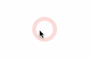
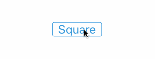
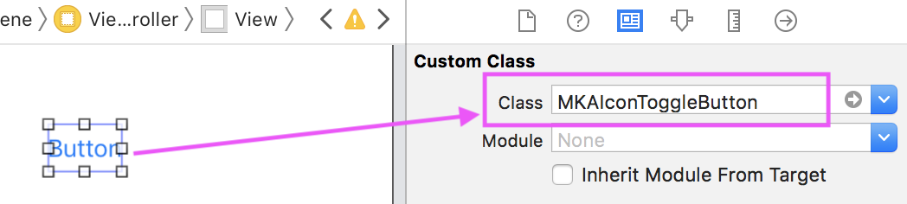
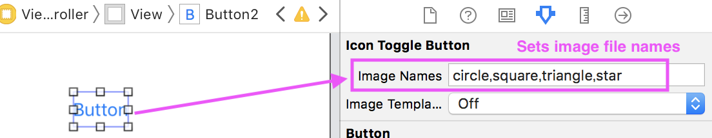

MKAToggleButton
===

MKAToggleButton is the button has multiple states for iOS. See following samples.



## Get Started
### Install Framework to Your iOS App

You have two ways to install this framework.

#### 1. CocoaPods

MKAToggleButton is available through [CocoaPods](http://cocoapods.org). To install
it, simply add the following line to your Podfile:

```ruby
pod "MKAToggleButton"
```

#### 2. Manual Installation

1. Download latest [MKAToggleButton](https://github.com/HituziANDO/MKAToggleButton/releases)
1. Drag & Drop MKAToggleButton.framework into your Xcode project

### Quick Usage

1. Import the framework
	
	```swift
	import MKAToggleButton
	```
	
2. Create an instance
	
	```swift
	private lazy var toggleButton: MKAIconToggleButton = {
        // Creates an instance with options.
        let button = MKAIconToggleButton(items: [MKAToggleItem(image: UIImage(named: "circle"), title: "Circle"),
                                                 MKAToggleItem(image: UIImage(named: "square"), title: "Square"),
                                                 MKAToggleItem(image: UIImage(named: "triangle"), title: "Triangle"),
                                                 MKAToggleItem(image: UIImage(named: "star"), title: "Start")],
                                         font: UIFont.systemFont(ofSize: 40.0, weight: .bold),
                                         color: .gray)

        // Should use the click handler for user interaction.
        button.onClicked = { button in
            // `currentStateIndex` property returns the current state.
            // The toggle button automatically increments the state each time it is clicked.
            // When the current state is last, the next state is rewinded to the first.
            print("index=\(button.currentStateIndex)")
        }

        // Sets the initial state. By default, the initial state index is zero.
        button.currentStateIndex = 1

        return button
    }()
	```
	
1. Add the toggle button to a parent view
	
	```swift
	override func viewDidLoad() {
        super.viewDidLoad()

        self.view.addSubview(self.toggleButton)
   }
	```
	
## Use the toggle button in the storyboard

You can use the MKAToggleButton in the storyboard. The usage is following.

1. Set `MKAIconToggleButton` class to Custom Class field in the storyboard
	
	
	
2. Set multiple image file names separated by commas to Image Names field
	
	
	
## Options
### Template Rendering Mode

When the template mode is enabled, the toggle button applies its tintColor to the icon images.

```swift
// Use the template rendering mode and set a color to `tintColor`.
toggleButton.isImageTemplate = true
toggleButton.tintColor = UIColor(red: 241.0 / 255.0, 
                                 green: 196.0 / 255.0, 
                                 blue: 15.0 / 255.0, 
                                 alpha: 1.0)
```

### Extend Touchable Area

You can extend touchable area of the button. Set `touchableExtensionXxxx` properties.

```swift
button.touchableExtensionTop = 16.0
button.touchableExtensionLeft = 40.0
button.touchableExtensionBottom = 16.0
button.touchableExtensionRight = 40.0
```

### Long Press Event Handler

You can set the event handler that handle the long press event.

```swift
button.longPressGesture.minimumPressDuration = 1.0
button.onLongPressBegan = { print("Began index=\($0.currentStateIndex)") }
button.onLongPressChanged = { print("Changed index=\($0.currentStateIndex)") }
button.onLongPressEnded = { print("Ended index=\($0.currentStateIndex)") }
button.onLongPressCancelled = { print("Cancelled index=\($0.currentStateIndex)") }
```

----

More info, see my [sample code](https://github.com/HituziANDO/MKAToggleButton/blob/master/Sample/MKAToggleButtonSwiftSample/ViewController.swift).
